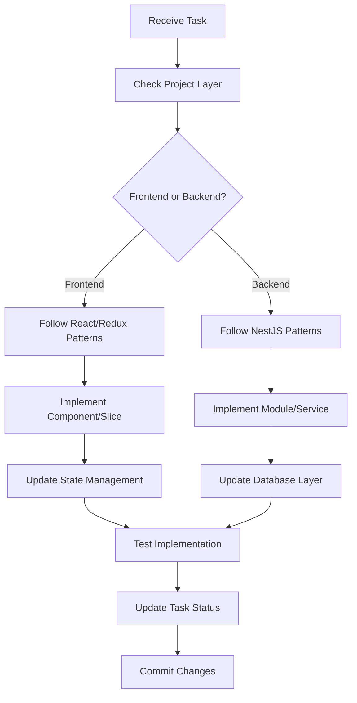

# RealWorld Project - Implementation Guidelines

## Purpose
This guide provides project-specific implementation instructions for the RealWorld (Conduit) application, ensuring consistent code execution across frontend (React/Redux) and backend (NestJS/MikroORM) components.

## Project Context

### Technology Stack
**Frontend:**
- React 18.2.0 + TypeScript 5.3.3
- Redux Toolkit 2.2.1 
- React Router DOM 6.22.2
- Vite 5.1.4
- Axios 1.6.7
- @hqoss/monads for error handling

**Backend:**
- NestJS 10.0.5
- MikroORM 5.7.14 + MySQL
- JWT + Passport authentication
- Swagger/OpenAPI documentation

## Implementation Workflow



## Frontend Implementation Patterns

### 1. Component Creation Task
When implementing a new React component:

```typescript
// Task: Create new Article component
// Location: frontend/src/components/Pages/Article/

// Step 1: Create component file (Article.tsx)
import { FC } from 'react';
import { useNavigate } from 'react-router-dom';
import { store } from '../../../state/store';
import { useStore, useStoreWithInitializer } from '../../../state/storeHooks';
import { ArticleState, initialize, updateField } from './Article.slice';

export function Article() {
  const { data, loading, errors } = useStoreWithInitializer(
    ({ article }) => article,
    () => store.dispatch(initialize())
  );
  
  // Component implementation
  return (
    <div className='article-page'>
      {/* JSX */}
    </div>
  );
}

// Step 2: Create Redux slice (Article.slice.tsx)
import { createSlice, PayloadAction } from '@reduxjs/toolkit';

export interface ArticleState {
  data: ArticleData | null;
  loading: boolean;
  errors: GenericErrors;
}

const initialState: ArticleState = {
  data: null,
  loading: false,
  errors: {},
};

const slice = createSlice({
  name: 'article',
  initialState,
  reducers: {
    initialize: () => initialState,
    startLoading: (state) => { state.loading = true; },
    loadSuccess: (state, { payload }: PayloadAction<ArticleData>) => {
      state.data = payload;
      state.loading = false;
    },
    loadError: (state, { payload }: PayloadAction<GenericErrors>) => {
      state.errors = payload;
      state.loading = false;
    },
  },
});

export const { initialize, startLoading, loadSuccess, loadError } = slice.actions;
export default slice.reducer;

// Step 3: Update store configuration
// In frontend/src/state/store.ts - add the new slice
```

### 2. API Service Integration Task
When adding API endpoints:

```typescript
// Task: Add article API methods
// Location: frontend/src/services/conduit.ts

import { Err, Ok, Result } from '@hqoss/monads';
import axios, { AxiosError } from 'axios';
import { articleDecoder } from '../types/article';
import { genericErrorsDecoder } from '../types/error';

// ALWAYS use Result monad for error handling
export async function createArticle(article: ArticleForEditor): Promise<Result<Article, GenericErrors>> {
  try {
    const { data } = await axios.post('articles', { article });
    return Ok(object({ article: articleDecoder }).verify(data).article);
  } catch (error) {
    const axiosError = error as AxiosError;
    return Err(object({ errors: genericErrorsDecoder }).verify(axiosError.response?.data).errors);
  }
}

// Add decoder for runtime validation
// In frontend/src/types/article.ts
export const articleDecoder = object({
  slug: string,
  title: string,
  description: string,
  body: string,
  tagList: array(string),
  createdAt: date,
  updatedAt: date,
  favorited: boolean,
  favoritesCount: number,
  author: profileDecoder,
});
```

### 3. Route Addition Task
When adding new routes:

```typescript
// Task: Add new route
// Location: frontend/src/components/App/App.tsx

// Add import
import { NewFeature } from '../Pages/NewFeature/NewFeature';

// In the App component's return statement
<HashRouter>
  <Switch>
    {/* Add route with proper authentication check */}
    {createUserOnlyRoute('/new-feature', <NewFeature />, userIsLogged)}
    {/* OR for public route */}
    <Route path='/new-feature' element={<NewFeature />} />
  </Switch>
</HashRouter>
```

## Backend Implementation Patterns

### 1. Module Creation Task
When implementing a new NestJS module:

```typescript
// Task: Create Product module
// Location: backend/src/product/

// Step 1: Create entity (product.entity.ts)
import { Entity, PrimaryKey, Property, ManyToOne } from '@mikro-orm/core';
import { User } from '../user/user.entity';

@Entity()
export class Product {
  @PrimaryKey({ type: 'number' })
  id: number;

  @Property({ fieldName: 'name' })
  name: string;

  @Property({ fieldName: 'price', type: 'decimal' })
  price: number;

  @ManyToOne(() => User, { fieldName: 'creator_id' })
  creator: User;

  @Property({ type: 'date', fieldName: 'created_at' })
  createdAt = new Date();

  constructor(creator: User, name: string, price: number) {
    this.creator = creator;
    this.name = name;
    this.price = price;
  }

  // ALWAYS include toJSON method for response formatting
  toJSON(user?: User) {
    const o = wrap(this).toObject();
    o.isOwner = user && this.creator.id === user.id;
    return o;
  }
}

// Step 2: Create DTO (dto/create-product.dto.ts)
import { IsNotEmpty, IsNumber, Min } from 'class-validator';

export class CreateProductDto {
  @IsNotEmpty()
  readonly name: string;

  @IsNumber()
  @Min(0)
  readonly price: number;
}

// Step 3: Create service (product.service.ts)
import { Injectable } from '@nestjs/common';
import { EntityManager } from '@mikro-orm/core';
import { InjectRepository } from '@mikro-orm/nestjs';
import { EntityRepository } from '@mikro-orm/mysql';
import { Product } from './product.entity';
import { User } from '../user/user.entity';

@Injectable()
export class ProductService {
  constructor(
    private readonly em: EntityManager,
    @InjectRepository(Product)
    private readonly productRepository: EntityRepository<Product>,
    @InjectRepository(User)
    private readonly userRepository: EntityRepository<User>,
  ) {}

  async create(userId: number, dto: CreateProductDto) {
    const user = await this.userRepository.findOne(userId);
    if (!user) {
      throw new NotFoundException('User not found');
    }
    
    const product = new Product(user, dto.name, dto.price);
    await this.em.persistAndFlush(product);
    
    return { product: product.toJSON(user) };
  }
}

// Step 4: Create controller (product.controller.ts)
import { Body, Controller, Get, Post, UseGuards } from '@nestjs/common';
import { ApiBearerAuth, ApiTags, ApiOperation } from '@nestjs/swagger';
import { User } from '../user/user.decorator';
import { CreateProductDto } from './dto';
import { ProductService } from './product.service';

@ApiBearerAuth()
@ApiTags('products')
@Controller('products')
export class ProductController {
  constructor(private readonly productService: ProductService) {}

  @ApiOperation({ summary: 'Create product' })
  @Post()
  async create(
    @User('id') userId: number,
    @Body('product') productData: CreateProductDto
  ) {
    return this.productService.create(userId, productData);
  }
}

// Step 5: Create module (product.module.ts)
import { Module } from '@nestjs/common';
import { MikroOrmModule } from '@mikro-orm/nestjs';
import { Product } from './product.entity';
import { ProductController } from './product.controller';
import { ProductService } from './product.service';
import { UserModule } from '../user/user.module';

@Module({
  imports: [
    MikroOrmModule.forFeature([Product]),
    UserModule,
  ],
  controllers: [ProductController],
  providers: [ProductService],
  exports: [ProductService],
})
export class ProductModule {}

// Step 6: Register in AppModule
// In backend/src/app.module.ts - add ProductModule to imports
```

### 2. Database Migration Task
When database schema changes:

```bash
# Task: Create migration for new table
cd backend
npx mikro-orm migration:create
```

```typescript
// Generated migration file
import { Migration } from '@mikro-orm/migrations';

export class Migration20240101000000 extends Migration {
  async up(): Promise<void> {
    this.addSql('CREATE TABLE `product` (...)');
  }

  async down(): Promise<void> {
    this.addSql('DROP TABLE `product`');
  }
}
```

## Task Execution Checklist

### Frontend Task Checklist
```markdown
- [ ] Component created with TypeScript interfaces
- [ ] Redux slice created if stateful
- [ ] Store updated with new slice
- [ ] API service method uses Result monad
- [ ] Decoders created for type validation
- [ ] Routes added to App.tsx
- [ ] Styles follow existing patterns
- [ ] Component exported from index file
```

### Backend Task Checklist
```markdown
- [ ] Entity created with MikroORM decorators
- [ ] toJSON method implemented on entity
- [ ] DTOs created with class-validator
- [ ] Service implements business logic
- [ ] Controller handles HTTP requests
- [ ] Module created and registered
- [ ] Swagger decorators added
- [ ] Migration created if needed
- [ ] Error handling with NestJS exceptions
```

## Implementation Commands

### Frontend Development
```bash
# Start frontend dev server
cd frontend && npm start

# Create new component directory
mkdir -p frontend/src/components/Pages/NewFeature

# Run linting
cd frontend && npm run lint

# Build for production
cd frontend && npm run build
```

### Backend Development
```bash
# Start backend dev server
cd backend && npm start

# Create new module structure
mkdir -p backend/src/new-module/{dto,interfaces}

# Generate migration
cd backend && npx mikro-orm migration:create

# Run migrations
cd backend && npx mikro-orm migration:up

# Run seeders
cd backend && npm run seed
```

## Common Implementation Patterns

### 1. Error Handling Pattern

**Frontend:**
```typescript
// Always use Result monad
const result = await apiCall();
result.match({
  ok: (data) => {
    store.dispatch(loadSuccess(data));
  },
  err: (errors) => {
    store.dispatch(loadError(errors));
  },
});
```

**Backend:**
```typescript
// Use NestJS exceptions
if (!resource) {
  throw new NotFoundException('Resource not found');
}
if (conflict) {
  throw new ConflictException('Resource already exists');
}
```

### 2. State Update Pattern

**Frontend:**
```typescript
// Use Redux Toolkit actions
store.dispatch(updateField({ name: 'email', value: 'test@example.com' }));
```

**Backend:**
```typescript
// Use MikroORM EntityManager
await this.em.persistAndFlush(entity);
// OR for updates
wrap(entity).assign(updates);
await this.em.flush();
```

### 3. Authentication Pattern

**Frontend:**
```typescript
// Store JWT in localStorage
localStorage.setItem('token', user.token);
axios.defaults.headers.Authorization = `Token ${user.token}`;
```

**Backend:**
```typescript
// Use User decorator in controllers
@Get('me')
async getCurrentUser(@User('id') userId: number) {
  return this.userService.findById(userId);
}
```

## Quality Standards

### Code MUST:
- [ ] Follow existing project patterns
- [ ] Include TypeScript types (no `any`)
- [ ] Handle errors appropriately
- [ ] Pass linting rules
- [ ] Include necessary comments
- [ ] Follow RealWorld API specification
- [ ] Maintain backward compatibility

### Before Marking Task Complete:
- [ ] Code implements specified functionality
- [ ] All requirements satisfied
- [ ] No regressions introduced
- [ ] Tests updated/added if needed
- [ ] Code reviewed against guidelines
- [ ] Task status updated in tracking

## Important Constraints

1. **Frontend Constraints:**
   - MUST use HashRouter (not BrowserRouter)
   - MUST use Result monads for API calls
   - MUST use decoders for validation
   - MUST follow Redux Toolkit slice pattern
   - MUST use custom store hooks

2. **Backend Constraints:**
   - MUST use MikroORM (not TypeORM)
   - MUST include toJSON on entities
   - MUST use DTOs for validation
   - MUST follow NestJS module pattern
   - MUST auto-run migrations on start

3. **General Constraints:**
   - MUST follow RealWorld specification
   - MUST maintain API compatibility
   - MUST update task tracking
   - MUST NOT implement out of scope
   - MUST NOT skip error handling

## Task Status Reporting Template

```markdown
# Task Implementation Complete

## Task: [Task Description]
**Component**: [Frontend/Backend]
**Module/Feature**: [Name]
**Status**: ✅ Completed

## Files Modified
- `[path/to/file1.ts]` - [What was changed]
- `[path/to/file2.tsx]` - [What was added]

## Implementation Details
### Frontend Changes:
- Component: [Name and location]
- Redux Slice: [If created]
- API Methods: [If added]
- Routes: [If modified]

### Backend Changes:
- Module: [Name]
- Entity: [If created]
- Service Methods: [List]
- Endpoints: [List with HTTP methods]

## Requirements Coverage
- ✅ [Requirement]: How addressed
- ✅ [Requirement]: How addressed

## Testing
- Unit Tests: [Added/Updated/Pending]
- Integration Tests: [Status]
- Manual Testing: [Completed areas]

## Next Steps
- Recommended next task: [Description]
```

## Integration with Other Guidelines

This implementation guide works in conjunction with:
- **Frontend Guidelines**: `/doc/project-specific-guidelines/frontend-guidelines.md`
- **Backend Guidelines**: `/doc/project-specific-guidelines/backend-guidelines.md`

Always consult the relevant guideline for detailed patterns and best practices.

---

Remember: This is a RealWorld specification implementation. Every implementation decision must maintain compatibility with the RealWorld API specification and the established patterns in the existing codebase.
