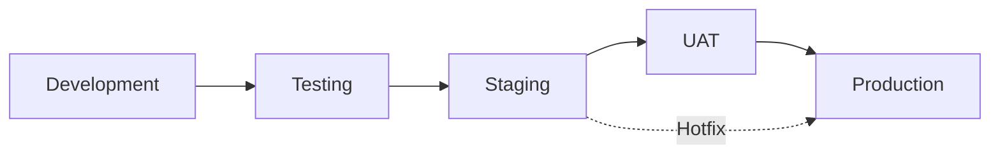

# Environment Configuration Specification

## Environment Strategy

### Environment Tiers
```yaml
environments:
  development:
    purpose: "Active development and testing"
    users: "Developers and QA"
    data: "Mock and synthetic data"
    stability: "Unstable - frequent changes"
    
  staging:
    purpose: "Pre-production testing and validation"
    users: "QA, Product, and select customers"
    data: "Production-like data (sanitized)"
    stability: "Stable - controlled releases"
    
  production:
    purpose: "Live customer environment"
    users: "End users and customers"
    data: "Real production data"
    stability: "Highly stable - scheduled releases"
    
  demo:
    purpose: "Sales and demonstrations"
    users: "Sales team and prospects"
    data: "Curated demo data"
    stability: "Stable - periodic updates"
```

## Development Environment

### Configuration
```typescript
interface DevelopmentConfig {
  api: {
    baseUrl: "http://localhost:8000";
    mockApi: true;
    delayResponses: 500; // ms
    errorRate: 0.1; // 10% error rate for testing
  };
  
  features: {
    debugMode: true;
    hotReload: true;
    sourceMaps: true;
    consoleLogging: true;
    performanceMonitoring: false;
    analytics: false;
  };
  
  auth: {
    provider: "mock";
    testUsers: [
      { email: "admin@test.com", role: "admin" },
      { email: "user@test.com", role: "user" }
    ];
    skipMFA: true;
  };
  
  data: {
    useMockData: true;
    seedDatabase: true;
    resetOnStartup: true;
  };
}
```

### Development Tools
```javascript
// .env.development
VITE_APP_ENV=development
VITE_API_BASE_URL=http://localhost:8000
VITE_MOCK_API=true
VITE_DEBUG_MODE=true
VITE_HOT_RELOAD=true

# Feature Flags
VITE_FEATURE_NEW_DASHBOARD=true
VITE_FEATURE_BETA_TOOLS=true
VITE_FEATURE_EXPERIMENTAL=true

# Development Services
VITE_LANGFLOW_BASE_URL=http://localhost:3000
VITE_MCP_HOST_URL=http://localhost:8001
```

### Docker Compose for Development
```yaml
version: '3.8'

services:
  frontend:
    build: .
    ports:
      - "5173:5173"
    volumes:
      - .:/app
      - /app/node_modules
    environment:
      - NODE_ENV=development
    command: npm run dev
    
  backend:
    image: alert-engine-api:dev
    ports:
      - "8000:8000"
    environment:
      - ENV=development
      - DEBUG=true
    
  postgres:
    image: postgres:14
    ports:
      - "5432:5432"
    environment:
      - POSTGRES_DB=alertengine_dev
      - POSTGRES_USER=dev_user
      - POSTGRES_PASSWORD=dev_pass
    
  redis:
    image: redis:7
    ports:
      - "6379:6379"
```

## Staging Environment

### Configuration
```typescript
interface StagingConfig {
  api: {
    baseUrl: "https://api-stage.alertengine.com";
    mockApi: false;
    timeout: 30000;
    retryAttempts: 3;
  };
  
  features: {
    debugMode: false;
    hotReload: false;
    sourceMaps: true;
    consoleLogging: false;
    performanceMonitoring: true;
    analytics: true;
  };
  
  auth: {
    provider: "cognito";
    userPoolId: "us-east-1_stagepool";
    clientId: "stage-client-id";
    region: "us-east-1";
    mfaRequired: false;
  };
  
  data: {
    useMockData: false;
    dataRefreshInterval: 60000; // 1 minute
  };
}
```

### Staging Infrastructure
```yaml
infrastructure:
  aws:
    account: "222222222222"
    region: "us-east-1"
    
  resources:
    s3_bucket: "alert-engine-ui-stage"
    cloudfront_id: "ESTAGE12345678"
    api_gateway: "stage-api-gateway"
    rds_instance: "alert-engine-stage-db"
    
  scaling:
    min_instances: 1
    max_instances: 3
    target_cpu: 70
    
  monitoring:
    enable_xray: true
    log_level: "INFO"
    retention_days: 30
```

### Staging Environment Variables
```javascript
// .env.staging
VITE_APP_ENV=staging
VITE_API_BASE_URL=https://api-stage.alertengine.com
VITE_MOCK_API=false
VITE_DEBUG_MODE=false

# Feature Flags
VITE_FEATURE_NEW_DASHBOARD=true
VITE_FEATURE_BETA_TOOLS=true
VITE_FEATURE_EXPERIMENTAL=false

# Analytics
VITE_GA_TRACKING_ID=UA-STAGE-001
VITE_SENTRY_DSN=https://stage@sentry.io/project

# Services
VITE_LANGFLOW_BASE_URL=https://langflow-stage.alertengine.com
VITE_COGNITO_USER_POOL=us-east-1_stagepool
```

## Production Environment

### Configuration
```typescript
interface ProductionConfig {
  api: {
    baseUrl: "https://api.alertengine.com";
    mockApi: false;
    timeout: 15000;
    retryAttempts: 5;
    cacheTimeout: 300000; // 5 minutes
  };
  
  features: {
    debugMode: false;
    hotReload: false;
    sourceMaps: false;
    consoleLogging: false;
    performanceMonitoring: true;
    analytics: true;
  };
  
  auth: {
    provider: "cognito";
    userPoolId: "us-east-1_prodpool";
    clientId: "prod-client-id";
    region: "us-east-1";
    mfaRequired: true;
    sessionTimeout: 3600000; // 1 hour
  };
  
  security: {
    enforceHTTPS: true;
    csrfProtection: true;
    rateLimiting: true;
    ddosProtection: true;
  };
}
```

### Production Infrastructure
```yaml
infrastructure:
  aws:
    account: "111111111111"
    region_primary: "us-east-1"
    region_secondary: "us-west-2"
    
  high_availability:
    multi_az: true
    auto_failover: true
    backup_retention: 30
    
  resources:
    s3_buckets:
      primary: "alert-engine-ui-prod"
      backup: "alert-engine-ui-prod-backup"
    
    cloudfront:
      distribution_id: "EPROD12345678"
      custom_domain: "alertengine.com"
      ssl_certificate: "arn:aws:acm:us-east-1:111111111111:certificate/prod"
    
    rds:
      instance_class: "db.r5.xlarge"
      storage_encrypted: true
      multi_az: true
      read_replicas: 2
    
  scaling:
    min_instances: 3
    max_instances: 20
    target_cpu: 60
    target_memory: 70
    
  monitoring:
    enable_xray: true
    enable_detailed_monitoring: true
    log_level: "WARN"
    retention_days: 90
    
  backup:
    strategy: "continuous"
    rpo: 1 # hour
    rto: 4 # hours
```

### Production Environment Variables
```javascript
// .env.production
VITE_APP_ENV=production
VITE_API_BASE_URL=https://api.alertengine.com
VITE_MOCK_API=false
VITE_DEBUG_MODE=false

# Feature Flags (Conservative)
VITE_FEATURE_NEW_DASHBOARD=false
VITE_FEATURE_BETA_TOOLS=false
VITE_FEATURE_EXPERIMENTAL=false

# Analytics & Monitoring
VITE_GA_TRACKING_ID=UA-PROD-001
VITE_GTM_ID=GTM-PROD001
VITE_SENTRY_DSN=https://prod@sentry.io/project
VITE_NEW_RELIC_KEY=prod-key-12345

# Services
VITE_LANGFLOW_BASE_URL=https://langflow.alertengine.com
VITE_COGNITO_USER_POOL=us-east-1_prodpool
VITE_CLOUDFRONT_URL=https://cdn.alertengine.com
```

## Demo Environment

### Configuration
```typescript
interface DemoConfig {
  api: {
    baseUrl: "https://api-demo.alertengine.com";
    mockApi: false;
    demoMode: true;
    resetInterval: 3600000; // Reset every hour
  };
  
  features: {
    guidedTour: true;
    sampleData: true;
    readOnly: false;
    watermark: true;
  };
  
  auth: {
    provider: "demo";
    autoLogin: true;
    demoUsers: [
      { name: "Admin Demo", role: "admin" },
      { name: "User Demo", role: "user" }
    ];
  };
  
  restrictions: {
    maxAlerts: 1000;
    dataRetention: "24h";
    exportDisabled: true;
    apiCallLimit: 1000;
  };
}
```

## Environment-Specific Features

### Feature Flags
```typescript
interface FeatureFlags {
  development: {
    enableAllFeatures: true;
    showDebugPanel: true;
    mockDataGenerator: true;
    unlimitedApiCalls: true;
  };
  
  staging: {
    enableBetaFeatures: true;
    showDebugPanel: false;
    performanceProfiling: true;
    abTesting: true;
  };
  
  production: {
    enableStableFeatures: true;
    showDebugPanel: false;
    performanceOptimized: true;
    gradualRollout: true;
  };
  
  demo: {
    enableDemoFeatures: true;
    showGuidedTour: true;
    limitedFunctionality: true;
    watermarkEnabled: true;
  };
}
```

## Environment Promotion Process

### Promotion Pipeline


### Promotion Criteria
```yaml
promotion_criteria:
  dev_to_staging:
    - all_tests_pass: true
    - code_coverage: ">= 80%"
    - no_critical_bugs: true
    - peer_review_approved: true
    
  staging_to_production:
    - qa_signoff: true
    - performance_benchmarks_met: true
    - security_scan_passed: true
    - change_request_approved: true
    - deployment_window_scheduled: true
    
  hotfix_process:
    - critical_issue_identified: true
    - emergency_change_approved: true
    - rollback_plan_ready: true
    - monitoring_enhanced: true
```

## Environment Monitoring

### Metrics per Environment
```typescript
interface EnvironmentMetrics {
  development: {
    track: ['errors', 'console_logs'];
    ignore: ['performance', 'user_behavior'];
  };
  
  staging: {
    track: ['errors', 'performance', 'api_calls'];
    alerting: 'email';
  };
  
  production: {
    track: ['all'];
    alerting: ['pagerduty', 'slack', 'email'];
    sla: {
      uptime: 99.9,
      responseTime: 200, // ms
      errorRate: 0.1 // %
    };
  };
}
```

## Configuration Management

### Environment Variables Management
```bash
#!/bin/bash
# scripts/manage-env.sh

ENVIRONMENT=$1

case $ENVIRONMENT in
  "development")
    cp .env.development .env.local
    echo "✅ Development environment configured"
    ;;
  "staging")
    cp .env.staging .env.local
    echo "✅ Staging environment configured"
    ;;
  "production")
    cp .env.production .env.local
    echo "⚠️  Production environment configured - BE CAREFUL!"
    ;;
  *)
    echo "❌ Unknown environment: $ENVIRONMENT"
    echo "Usage: ./manage-env.sh [development|staging|production]"
    exit 1
    ;;
esac
```

### Secrets Management
```typescript
interface SecretsConfig {
  provider: 'aws-secrets-manager' | 'hashicorp-vault' | 'azure-keyvault';
  
  secrets: {
    development: {
      storage: 'local-env-file';
      rotation: 'manual';
    };
    
    staging: {
      storage: 'aws-secrets-manager';
      rotation: 'monthly';
    };
    
    production: {
      storage: 'aws-secrets-manager';
      rotation: 'weekly';
      audit: true;
      encryption: 'kms';
    };
  };
}
```

## ✅ Environment Setup Checklist

### Development Environment
- [ ] Local development server running
- [ ] Mock API configured
- [ ] Test data seeded
- [ ] Hot reload working
- [ ] Debug tools enabled
- [ ] All feature flags enabled

### Staging Environment
- [ ] Staging API connected
- [ ] Authentication configured
- [ ] Test users created
- [ ] Monitoring enabled
- [ ] Performance profiling active
- [ ] Beta features enabled

### Production Environment
- [ ] Production API verified
- [ ] SSL certificates valid
- [ ] Security headers configured
- [ ] Monitoring and alerting active
- [ ] Backup strategy implemented
- [ ] Disaster recovery tested
- [ ] SLA monitoring enabled

### All Environments
- [ ] Environment variables documented
- [ ] Secrets properly managed
- [ ] CI/CD pipeline configured
- [ ] Rollback procedures tested
- [ ] Access controls implemented
- [ ] Audit logging enabled

## 📝 Best Practices

1. **Never use production data in non-production environments**
2. **Always use environment-specific API keys and secrets**
3. **Implement proper data sanitization for staging**
4. **Use feature flags for gradual rollouts**
5. **Monitor all environments, but with different thresholds**
6. **Document environment-specific behaviors**
7. **Automate environment provisioning where possible**
8. **Regular environment health checks**

---

*This specification defines environment-specific configurations and management strategies. Always follow the principle of least privilege and never compromise on security for convenience.*
