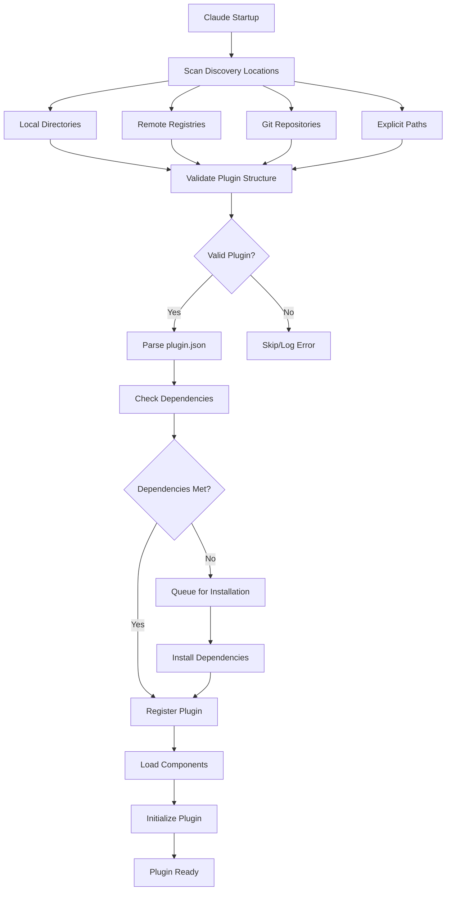

# 🔍 Claude Plugin Discovery Specification

## How Claude Discovers and Loads Plugins

This document describes the technical details of how Claude discovers, validates, and loads plugins like the DevOps Assistant.

## Discovery Flow



## Discovery Methods

### 1. File System Discovery

Claude scans these directories in order:

```python
# Discovery priority order
DISCOVERY_PATHS = [
    # 1. Current workspace
    "./.claude-plugins/",
    "./plugins/",
    
    # 2. User home directory
    "~/.claude/plugins/",
    "~/.config/claude/plugins/",
    
    # 3. System directories
    "/usr/local/claude/plugins/",
    "/opt/claude/plugins/",
    
    # 4. Environment variable paths
    os.environ.get("CLAUDE_PLUGIN_PATH", "").split(":")
]
```

**Discovery Algorithm**:

```python
def discover_plugins():
    plugins = {}
    
    for path in DISCOVERY_PATHS:
        if not os.path.exists(path):
            continue
            
        for entry in os.listdir(path):
            plugin_dir = os.path.join(path, entry)
            manifest_path = os.path.join(plugin_dir, ".claude-plugin", "plugin.json")
            
            if os.path.exists(manifest_path):
                try:
                    plugin = load_plugin_manifest(manifest_path)
                    if validate_plugin(plugin):
                        plugins[plugin['name']] = plugin
                except Exception as e:
                    log_error(f"Failed to load plugin from {plugin_dir}: {e}")
    
    return plugins
```

### 2. Registry Discovery

Claude queries configured registries for available plugins:

```json
// ~/.claude/config.json
{
  "plugin_registries": [
    {
      "name": "official",
      "url": "https://registry.claude.ai/api/v1",
      "type": "claude-registry",
      "auth": "optional"
    },
    {
      "name": "npm",
      "url": "https://registry.npmjs.org",
      "type": "npm",
      "prefix": "@claude-plugin/"
    },
    {
      "name": "github",
      "url": "https://api.github.com",
      "type": "github",
      "search": "topic:claude-plugin"
    }
  ]
}
```

**Registry API Request**:

```http
GET https://registry.claude.ai/api/v1/plugins/search?q=devops
Authorization: Bearer {token}

Response:
{
  "plugins": [
    {
      "name": "devops-assistant",
      "version": "1.0.0",
      "description": "DevOps automation plugin",
      "downloadUrl": "https://registry.claude.ai/downloads/devops-assistant-1.0.0.tar.gz",
      "manifest": { ... },
      "verified": true,
      "downloads": 1534,
      "rating": 4.8
    }
  ]
}
```

### 3. Git Repository Discovery

Claude can discover plugins from Git repositories:

```bash
# Plugin repository structure must have:
repository-root/
├── .claude-plugin/
│   └── plugin.json    # Required manifest
├── package.json       # Optional: for npm dependencies
├── requirements.txt   # Optional: for Python dependencies
└── ... plugin files ...
```

**Git Discovery Process**:

```python
def discover_from_git(repo_url):
    # 1. Check for .claude-plugin/plugin.json in default branch
    manifest_url = f"{repo_url}/raw/main/.claude-plugin/plugin.json"
    
    try:
        response = requests.get(manifest_url)
        if response.status_code == 200:
            return json.loads(response.text)
    except:
        pass
    
    # 2. Check releases for plugin packages
    if "github.com" in repo_url:
        api_url = repo_url.replace("github.com", "api.github.com/repos")
        releases = requests.get(f"{api_url}/releases/latest").json()
        
        for asset in releases.get('assets', []):
            if asset['name'].endswith('.claude-plugin'):
                return {"download_url": asset['browser_download_url']}
    
    return None
```

### 4. Manifest-Based Discovery

Claude can discover plugins via manifest URLs:

```bash
# Direct manifest URL
claude plugin discover https://example.com/plugins/devops/manifest.json

# Local manifest file
claude plugin discover file:///path/to/plugin/manifest.json

# Network share
claude plugin discover smb://server/share/plugins/devops-assistant
```

## Plugin Validation

### Manifest Validation

Claude validates the plugin manifest (`plugin.json`) against a JSON schema:

```json
{
  "$schema": "http://json-schema.org/draft-07/schema#",
  "type": "object",
  "required": ["name", "version", "description"],
  "properties": {
    "name": {
      "type": "string",
      "pattern": "^[a-z0-9-]+$"
    },
    "version": {
      "type": "string",
      "pattern": "^\\d+\\.\\d+\\.\\d+(-[a-z]+\\.\\d+)?$"
    },
    "description": {
      "type": "string",
      "maxLength": 500
    },
    "claude": {
      "type": "object",
      "properties": {
        "minVersion": {"type": "string"},
        "maxVersion": {"type": "string"}
      }
    },
    "permissions": {
      "type": "array",
      "items": {
        "type": "string",
        "enum": [
          "file:read",
          "file:write",
          "process:execute",
          "network:http",
          "system:env"
        ]
      }
    }
  }
}
```

### Structure Validation

```python
def validate_plugin_structure(plugin_path):
    required_files = [
        ".claude-plugin/plugin.json"
    ]
    
    optional_dirs = [
        "commands",
        "agents", 
        "skills",
        "hooks",
        "scripts"
    ]
    
    # Check required files
    for file in required_files:
        if not os.path.exists(os.path.join(plugin_path, file)):
            return False, f"Missing required file: {file}"
    
    # Verify at least one component exists
    has_component = False
    for dir in optional_dirs:
        dir_path = os.path.join(plugin_path, dir)
        if os.path.exists(dir_path) and os.listdir(dir_path):
            has_component = True
            break
    
    if not has_component:
        return False, "Plugin must have at least one component"
    
    return True, "Valid structure"
```

### Security Validation

```python
def validate_plugin_security(plugin):
    # Check for suspicious patterns
    suspicious_patterns = [
        r"eval\(",
        r"exec\(",
        r"__import__",
        r"os\.system",
        r"subprocess\.call.*shell=True"
    ]
    
    # Scan all script files
    for root, dirs, files in os.walk(plugin['path']):
        for file in files:
            if file.endswith(('.py', '.js', '.sh')):
                content = open(os.path.join(root, file)).read()
                for pattern in suspicious_patterns:
                    if re.search(pattern, content):
                        log_warning(f"Suspicious pattern found: {pattern} in {file}")
    
    # Verify digital signature if present
    if plugin.get('signature'):
        return verify_signature(plugin['path'], plugin['signature'])
    
    return True
```

## Loading Process

### 1. Dependency Resolution

```python
def resolve_dependencies(plugin):
    deps = plugin.get('dependencies', {})
    
    # System dependencies
    for cmd, version in deps.items():
        if not check_command_exists(cmd, version):
            install_dependency(cmd, version)
    
    # Node.js dependencies
    if os.path.exists(f"{plugin['path']}/package.json"):
        run_command(f"cd {plugin['path']} && npm install")
    
    # Python dependencies
    if os.path.exists(f"{plugin['path']}/requirements.txt"):
        run_command(f"pip install -r {plugin['path']}/requirements.txt")
```

### 2. Component Loading

```python
def load_plugin_components(plugin):
    components = {
        'commands': [],
        'agents': [],
        'skills': [],
        'hooks': [],
        'mcp_servers': []
    }
    
    # Load commands
    commands_dir = f"{plugin['path']}/commands"
    if os.path.exists(commands_dir):
        for file in glob.glob(f"{commands_dir}/*.md"):
            command = parse_command_file(file)
            components['commands'].append(command)
    
    # Load agents
    agents_dir = f"{plugin['path']}/agents"
    if os.path.exists(agents_dir):
        for file in glob.glob(f"{agents_dir}/*.md"):
            agent = parse_agent_file(file)
            components['agents'].append(agent)
    
    # Load skills
    skills_dir = f"{plugin['path']}/skills"
    if os.path.exists(skills_dir):
        for skill_dir in os.listdir(skills_dir):
            skill = load_skill(f"{skills_dir}/{skill_dir}")
            components['skills'].append(skill)
    
    # Load hooks
    hooks_files = glob.glob(f"{plugin['path']}/hooks/*.json")
    for hook_file in hooks_files:
        hooks = json.load(open(hook_file))
        components['hooks'].extend(hooks.get('hooks', []))
    
    # Load MCP servers
    mcp_file = f"{plugin['path']}/.mcp.json"
    if os.path.exists(mcp_file):
        mcp_config = json.load(open(mcp_file))
        components['mcp_servers'] = mcp_config.get('servers', [])
    
    return components
```

### 3. Registration and Activation

```python
class PluginRegistry:
    def __init__(self):
        self.plugins = {}
        self.commands = {}
        self.agents = {}
        self.skills = {}
        self.hooks = []
    
    def register_plugin(self, plugin, components):
        # Register plugin
        self.plugins[plugin['name']] = {
            'manifest': plugin,
            'components': components,
            'status': 'active',
            'loaded_at': datetime.now()
        }
        
        # Register commands with prefix
        prefix = plugin.get('commands', {}).get('prefix', plugin['name'])
        for command in components['commands']:
            self.commands[f"@{prefix} {command['name']}"] = command
        
        # Register agents
        for agent in components['agents']:
            self.agents[agent['name']] = agent
        
        # Register skills
        for skill in components['skills']:
            self.skills[skill['name']] = skill
        
        # Register hooks
        self.hooks.extend(components['hooks'])
        
        # Initialize MCP connections
        for server in components['mcp_servers']:
            self.connect_mcp_server(server)
        
        log_info(f"Plugin '{plugin['name']}' registered successfully")
```

## Hot Reload Support

Claude supports hot reloading of plugins during development:

```python
class PluginWatcher:
    def __init__(self, plugin_path):
        self.plugin_path = plugin_path
        self.observer = Observer()
        self.observer.schedule(
            PluginChangeHandler(self.on_change),
            plugin_path,
            recursive=True
        )
    
    def on_change(self, event):
        if event.src_path.endswith('.json'):
            # Reload manifest
            self.reload_manifest()
        elif event.src_path.endswith('.md'):
            # Reload command/agent
            self.reload_component(event.src_path)
        elif event.src_path.endswith(('.py', '.js', '.sh')):
            # Reload script
            self.reload_script(event.src_path)
    
    def reload_plugin(self):
        log_info(f"Reloading plugin: {self.plugin_path}")
        unload_plugin(self.plugin_path)
        load_plugin(self.plugin_path)
```

## Discovery Cache

Claude caches discovered plugins for performance:

```json
// ~/.claude/cache/plugins.json
{
  "version": "1.0.0",
  "last_scan": "2024-01-15T10:00:00Z",
  "plugins": {
    "devops-assistant": {
      "path": "/home/user/.claude/plugins/devops-assistant",
      "manifest": { ... },
      "checksum": "sha256:abcd1234...",
      "last_modified": "2024-01-15T09:00:00Z"
    }
  },
  "registries": {
    "official": {
      "last_fetch": "2024-01-15T10:00:00Z",
      "plugins": [ ... ]
    }
  }
}
```

**Cache Invalidation**:

```python
def should_refresh_cache():
    # Refresh if:
    # 1. Cache is older than 24 hours
    # 2. User explicitly requests refresh
    # 3. File system changes detected
    # 4. New plugin path added
    
    cache_age = datetime.now() - cache['last_scan']
    return cache_age.hours > 24
```

## Performance Optimization

### Parallel Discovery

```python
async def discover_all_plugins():
    tasks = []
    
    # Parallel file system scan
    for path in DISCOVERY_PATHS:
        tasks.append(scan_directory_async(path))
    
    # Parallel registry queries
    for registry in REGISTRIES:
        tasks.append(query_registry_async(registry))
    
    # Wait for all discoveries
    results = await asyncio.gather(*tasks)
    
    # Merge results
    return merge_plugin_lists(results)
```

### Lazy Loading

```python
class LazyPlugin:
    def __init__(self, manifest_path):
        self.manifest_path = manifest_path
        self._manifest = None
        self._components = None
    
    @property
    def manifest(self):
        if self._manifest is None:
            self._manifest = json.load(open(self.manifest_path))
        return self._manifest
    
    @property
    def components(self):
        if self._components is None:
            self._components = load_plugin_components(self.manifest)
        return self._components
```

## Best Practices for Plugin Authors

1. **Use Unique Names**: Choose descriptive, unique plugin names
2. **Version Properly**: Follow semantic versioning
3. **Declare Dependencies**: List all required dependencies
4. **Request Minimal Permissions**: Only request necessary permissions
5. **Provide Metadata**: Include description, author, and keywords
6. **Test Discovery**: Test plugin discovery in different environments
7. **Sign Plugins**: Digitally sign plugins for security
8. **Cache Appropriately**: Implement caching for expensive operations
9. **Handle Errors**: Gracefully handle missing dependencies
10. **Document Requirements**: Clearly document system requirements

---

*This specification is part of the Claude Plugin SDK v1.0.0*
